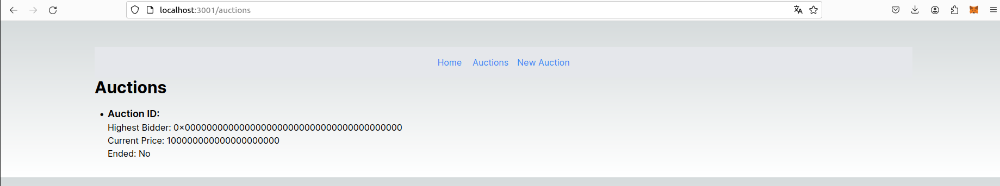

# Application décentralisée d'enchères hollandaises

|   Nom   | Prénom |
|---------|--------|
|   KHADDOR  |  EL Mehdi  |

## Présentation

Ce projet constitue la réalisation d'une application décentralisée (dApp) pour la gestion d'enchères hollandaises. L'objectif est de créer une interface conviviale permettant aux utilisateurs d'interagir avec un Smart Contract déployé sur la blockchain Ethereum. Les principales fonctionnalités incluent l'authentification via MetaMask, la gestion des enchères, et un tableau de bord récapitulatif des activités des utilisateurs.

## Fonctionnalités
### Authentification et profil
- Connexion via MetaMask : Les utilisateurs peuvent se connecter à l'application en utilisant leur portefeuille MetaMask.
- Affichage des données du portefeuille : Les informations telles que la clé publique et le solde en ETH sont visibles depuis l'application.

### Enchères
- Liste des enchères disponibles : Une vue liste permet d'afficher toutes les enchères disponibles.
- Création d'une enchère : Les propriétaires peuvent créer une nouvelle enchère en définissant les paramètres souhaités.
- Tableau de bord : Un tableau de bord offre une vue récapitulative des enchères gagnées, en cours ou perdues.

### Navigation 
- Barre de navigation : Une barre de navigation est disponible pour accéder facilement aux différentes fonctionnalités de l'application.

### Interaction avec la blockchain 
- Utilisation de bibliothèques : L'application interagit avec la blockchain Ethereum en utilisant des bibliothèques web3js.

## Application 

#### Connection au Wallet 

#### Informations d'utilisateur
- Addresse et solde du portefeulle MetaMask

#### Création d'un nouveau enchère

#### Affichage des enchères

### Installation 
1. Clonage du projet : Clonez ce projet dans le répertoire de votre choix
` git clone `
2. Installation des dépendances : Exécutez la commande suivante pour installer les dépendances nécessaires au projet `npm install`
3. Lancement de l'application : `npm run dev`

